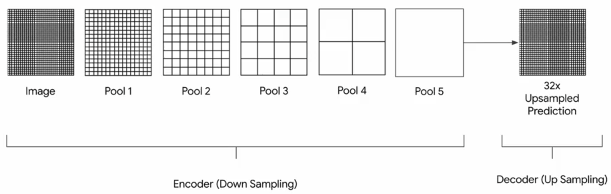
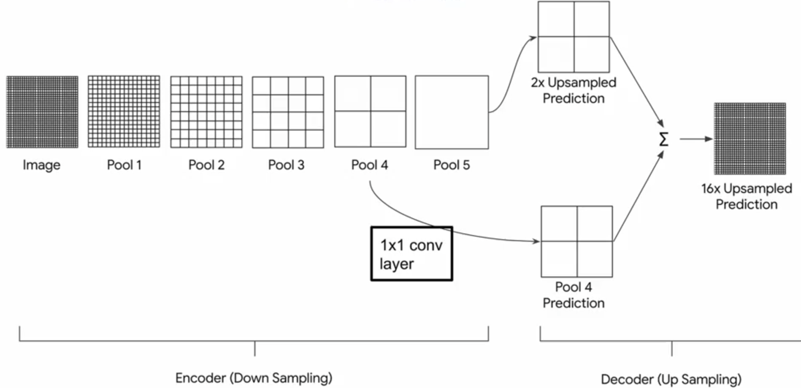
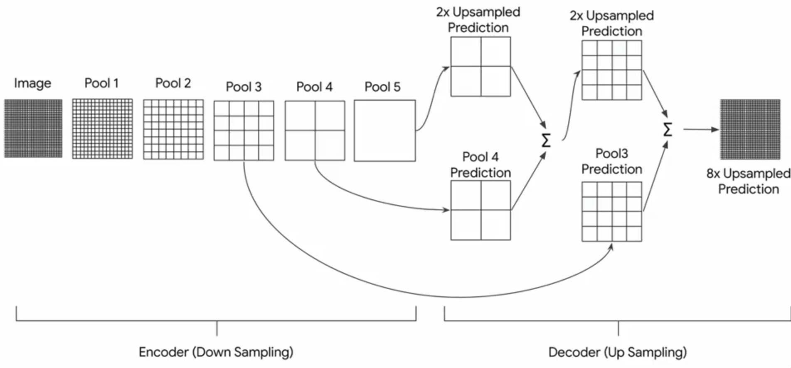
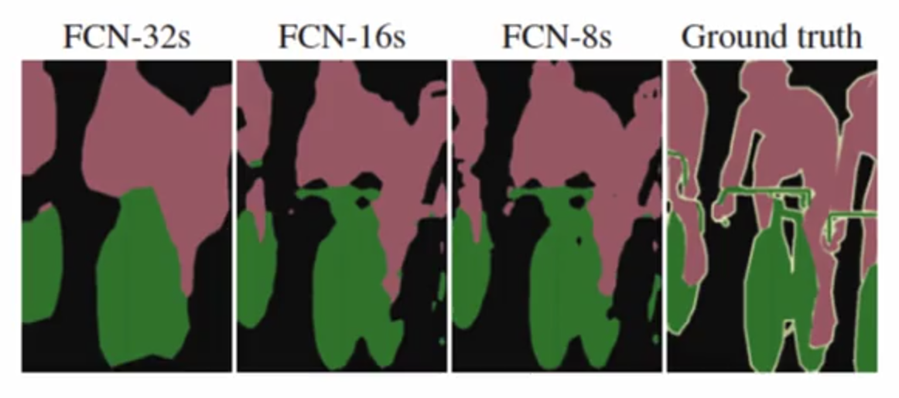

# Fully Convolutional Networks for Semantic Segmentation

## Architectures

### FCN-32

  
   
  <figcaption>Figure 1: FCN-32 Architecture</figcaption>

### FCN-16

  
   
  <figcaption>Figure 1: FCN-16 Architecture</figcaption>

### FCN-8

  
   
  <figcaption>Figure 1: FCN-8 Architecture</figcaption>

### Comparison of different FCNs

  
   

# Training

- Dataset: The Cambridge Driving (CamVid) (https://github.com/divamgupta/image-segmentation-keras)

- Encoder: pretrained VGG-16 Conv Layers
- Decoder: FCN-8

# References

- https://arxiv.org/abs/1411.4038