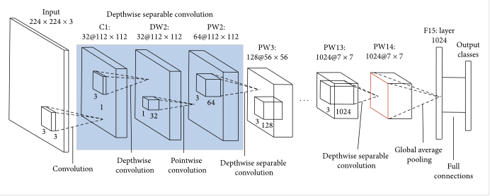
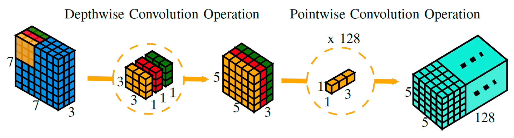

# MobileNets: Efficient Convolutional Neural Networks for Mobile Vision Applications

## Architecture

  
   
  <figcaption>Figure 1: MobileNetV1 Architecture</figcaption>

### Depthwise Separable Convolution

  
   
  <figcaption>Figure 2: Depthwise Separable Convolution</figcaption>

# Training

- Dataset: CIFAR-10 

# References

- https://arxiv.org/abs/1704.04861