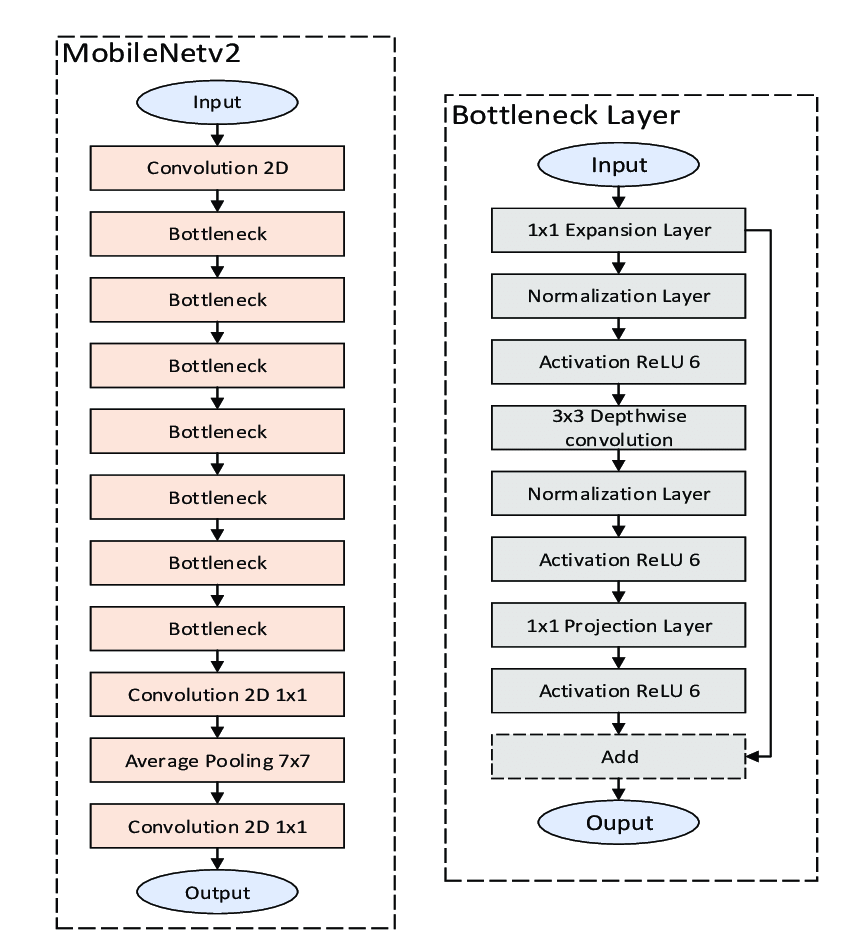
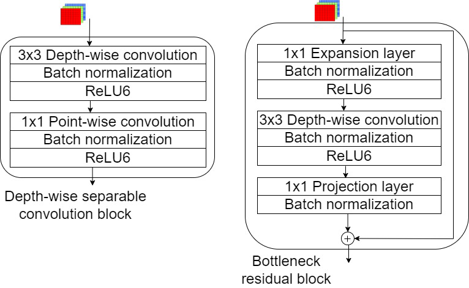

# MobileNetV2: Inverted Residuals and Linear Bottlenecks

## Architecture

  
   
  <figcaption>Figure 1: MobileNetV2 Architecture</figcaption>

### Depth-wise separable block(v1) VS Bottleneck residual block(v2)

  
   
  <figcaption>Figure 1: MobileNetV2 Architecture</figcaption>

# Training

- Dataset: 

# References

- https://arxiv.org/abs/1801.04381