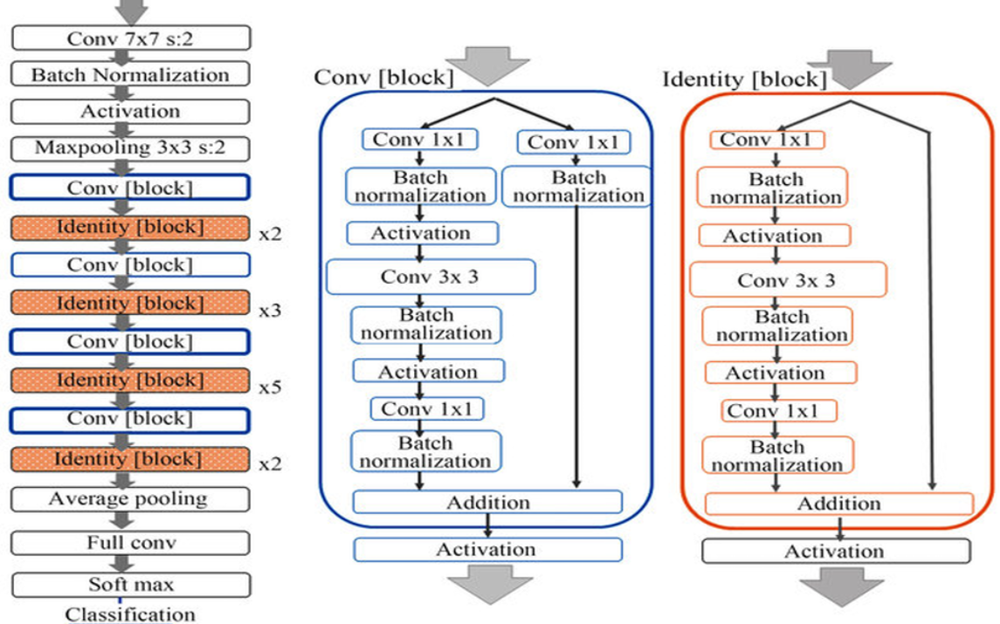

# Deep Residual Learning for Image Recognition 

## Architectures

  
   
  <figcaption>Figure 1: ResNet-50 Architecture</figcaption>

# Training

- Dataset: SIGNS dataset

# References

- https://arxiv.org/abs/1512.03385