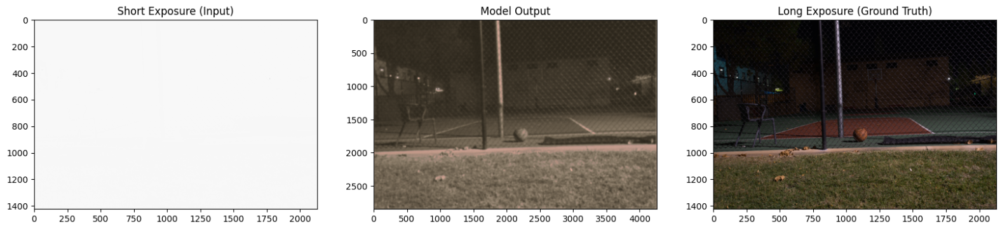

# Learning to See in the Dark 

## Architecture

  
   
  <figcaption>Figure 1: SID Architecture</figcaption>

# Training

- Dataset: [Sony Low-Light RAW Image Dataset](https://www.kaggle.com/datasets/jungmoo/sid-sony-dataset/versions/1) 

  
   
  <figcaption>Figure 2: SID model output</figcaption>

the model trained for 10 epochs

- Average SSIM: 0.6209
- Average PSNR: 18.78 dB

# References

- https://arxiv.org/abs/1805.01934 