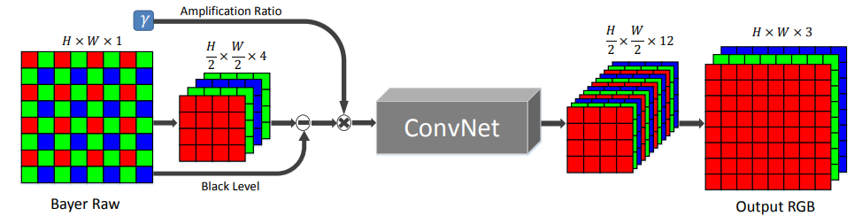

# Learning to See in the Dark 

## Architecture

  
   
  <figcaption>Figure 1: SID Architecture</figcaption>

# Training

- Dataset: [Nikon Low-Light RAW Image Dataset](https://www.kaggle.com/datasets/razorblade/nikon-camera-dataset) 

# References

- https://arxiv.org/abs/1805.01934 