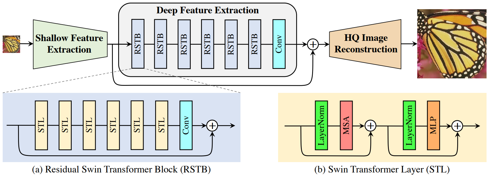

# SwinIR: Image Restoration Using Swin Transformer

## Architecture

  
   
  <figcaption>Figure 1: SwinIR Architecture</figcaption>

# Training

- Dataset: [Sony Low-Light RAW Image Dataset](https://www.kaggle.com/datasets/jungmoo/sid-sony-dataset/versions/1) 
- Encoder: Swin Transformer (feature extractor)
- Decoder: U-net Upsampling

# References

- https://arxiv.org/abs/2108.10257
- [Swin Transformer](https://huggingface.co/docs/transformers/en/model_doc/swin)