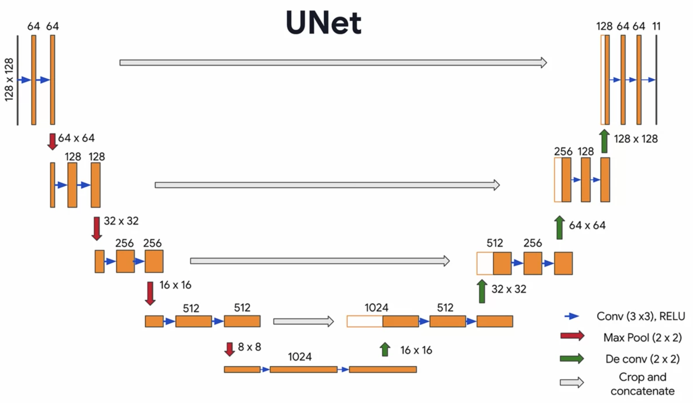

# U-Net: Convolutional Networks for Biomedical Image Segmentation

## Architectures

  
   
  <figcaption>Figure 1: UNet Architecture</figcaption>

# Training

- Dataset: [Oxford Pets - IIT dataset](https://www.robots.ox.ac.uk/~vgg/data/pets/)

# References

- https://arxiv.org/abs/1505.04597