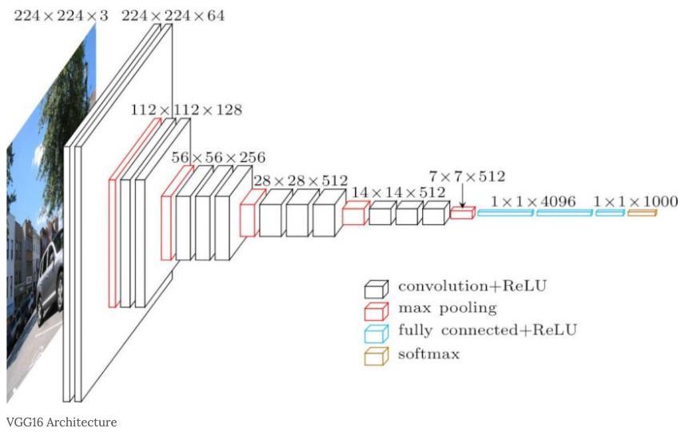

# Very Deep Convolutional Networks for Large-Scale Image Recognition 

## Architectures

### VGG-16

  
   
  <figcaption>Figure 1: VGG-16 Architecture</figcaption>

# Training

Dataset: CIFAR-10 

# References

https://arxiv.org/abs/1409.1556